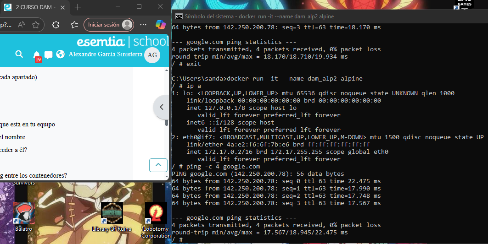

1. Para descargar alpine sin arrancarlo utilizamos docker pull alpine

comprobamos la descarga con docker images

2. Para crear un contenedor sin nombre utilizamos docker create alpine(con una sola vez sirve, yo lo hice 2 sin querer), con docker ps mostramos los contenedores en ejecucion, con ps -a se ven todos los creados.

3. Para crear un contenedor con el nombre dam_alp1 y acceder a el, tienes q escribir docker run -it --name (aqui el nombre sin parentesis) alpine. Cuando lo crees entrarás automaticamente a él, para salir puedes escribir exit.

4. Para comprobar la ip escribimos ip a, y para el ping se escribe ping -c 4 google.com, lo normal es hacer ping 4 veces, por eso el 4.

5. Ahora combinamos el apartado 3 y el 4, creando el contenedor dam_alp2, los comandos son los mismos.

6.