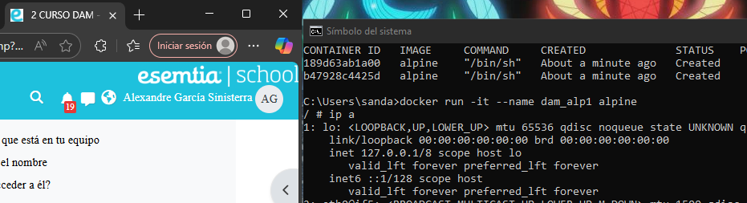
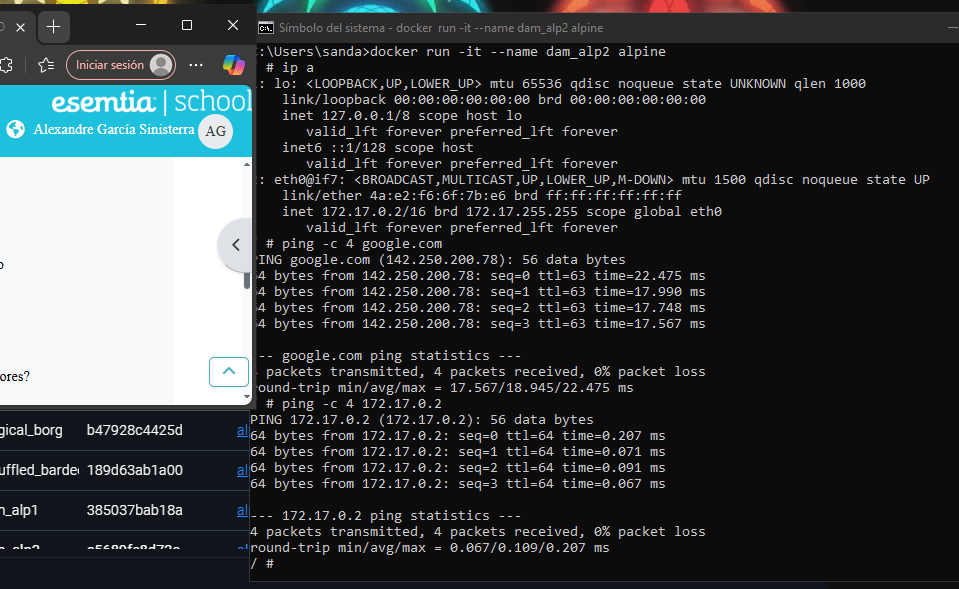
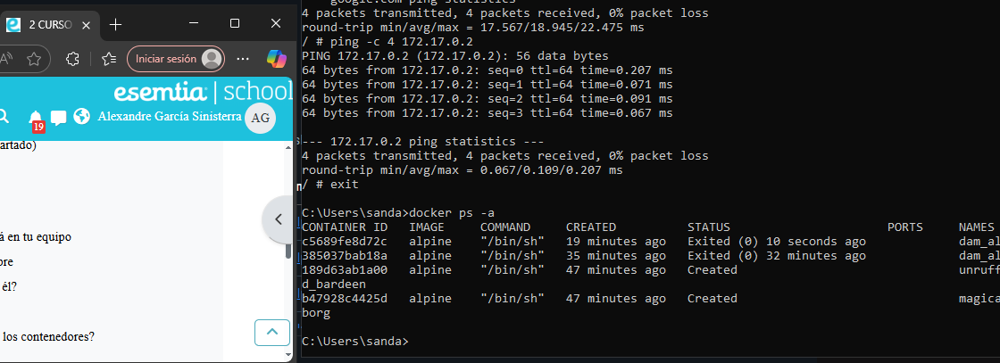
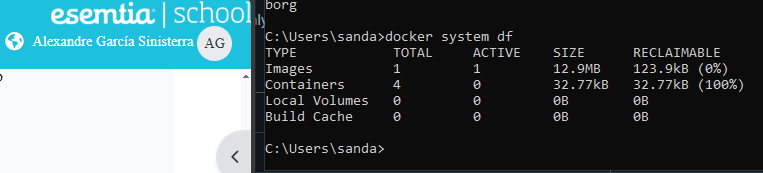
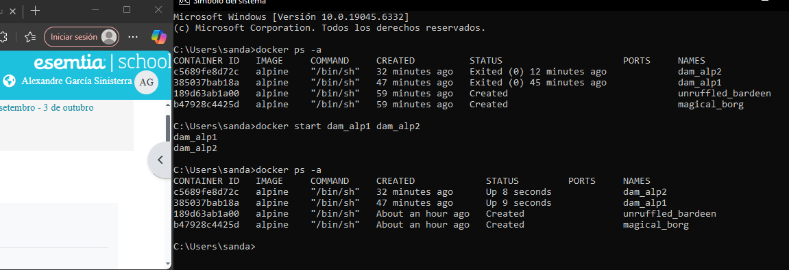
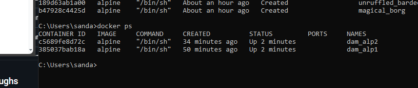
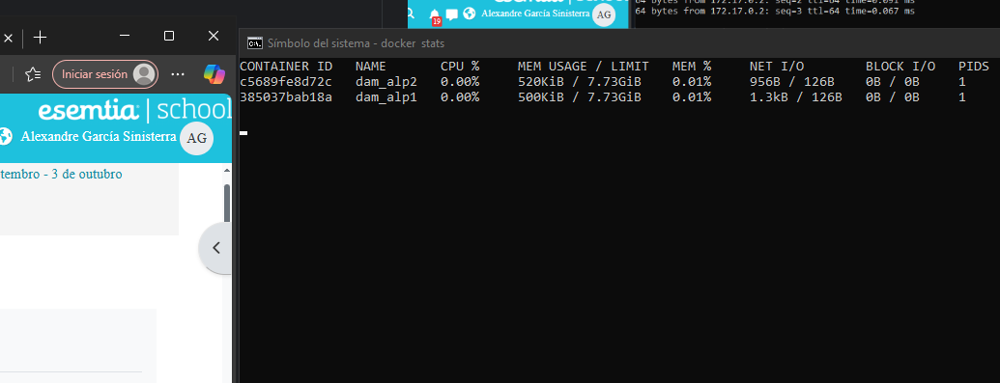

1. Para descargar alpine sin arrancarlo utilizamos docker pull alpine

comprobamos la descarga con docker images

2. Para crear un contenedor sin nombre utilizamos docker create alpine(con una sola vez sirve, yo lo hice 2 sin querer), con docker ps mostramos los contenedores en ejecucion, con ps -a se ven todos los creados.

3. Para crear un contenedor con el nombre dam_alp1 y acceder a el, tienes q escribir docker run -it --name (aqui el nombre sin parentesis) alpine. Cuando lo crees entrarás automaticamente a él, para salir puedes escribir exit.

4. Para comprobar la ip escribimos ip a, y buscamos el apartado donde pone eth0@if5, y para el ping se escribe ping -c 4 google.com, lo normal es hacer ping 4 veces, por eso el 4.

5. Ahora creamos el contenedor dam_alp2 e intentamos hacer ping entre ellos con ping -c 4 (y la ip del otro contenedor)

6. Al salir podemos ver con docker ps -a que pone cuando saliste de cada contenedor

7. Para mirar la cantidad de memoria ocupada en el disco simplemente escribes docker system df

8. Para mirar cuanta ram ocupan tienes que escribir docker stats, pero ojo, solo ocupan si estan corriendo, asique para esto necesitamos correrlos antes con docker start (y los nombres), como puedes observar cuando hacemos ps -a se ve como cambio el status y de hecho podemos escribir simplemente docker ps.

