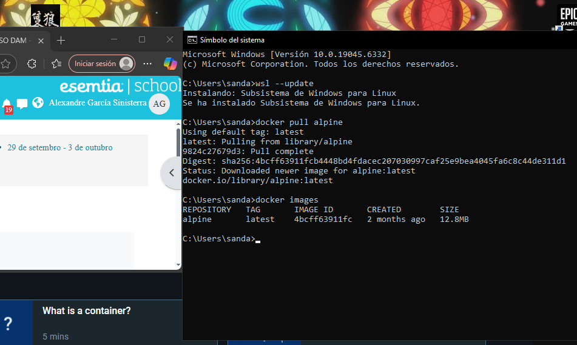
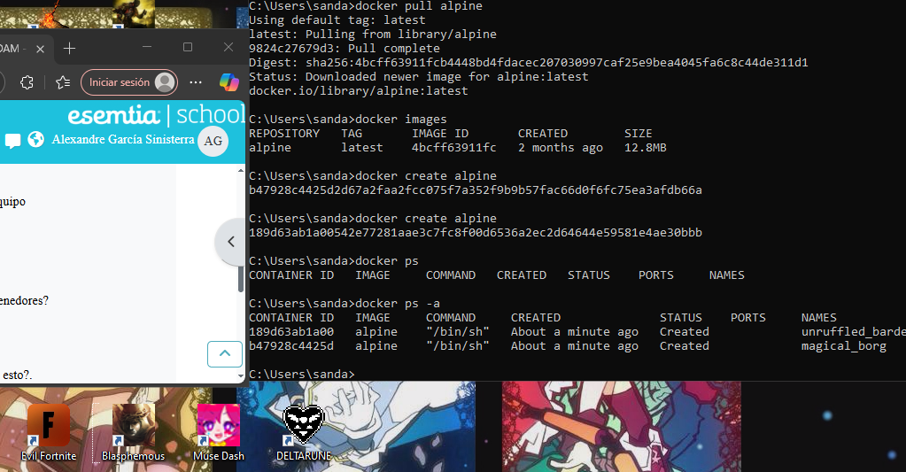

1. Para descargar alpine sin arrancarlo utilizamos docker pull alpine

comprobamos la descarga con docker images

2. Para crear un contenedor sin nombre utilizamos docker create alpine(con una sola vez sirve, yo lo hice 2 sin querer), con docker ps mostramos los contenedores en ejecucion, con ps -a se ven todos los creados.

3.