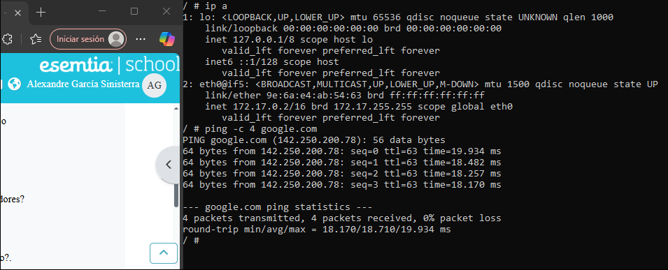

# Guía: Uso básico de Alpine en Docker

---

## 1. Descargar Alpine sin arrancarlo

Para descargar la imagen de Alpine:

```bash
docker pull alpine
```

Comprobamos la descarga con:

```bash
docker images
```


---

## 2. Crear un contenedor sin nombre

Para crear un contenedor **sin nombre**:

```bash
docker create alpine
```

*(Con una sola vez es suficiente; en el ejemplo se hizo dos veces por error.)*

Con el siguiente comando vemos los contenedores en ejecución:

```bash
docker ps
```

Y con este vemos **todos los contenedores creados**:

```bash
docker ps -a
```


---

## 3. Crear un contenedor con nombre y acceder a él

Para crear un contenedor llamado `dam_alp1` y entrar directamente en él:

```bash
docker run -it --name dam_alp1 alpine
```

Entrarás automáticamente al contenedor.
Para salir, escribe:

```bash
exit
```


---

## 4. Comprobar la IP y hacer ping

Dentro del contenedor, para ver la IP:

```bash
ip a
```

Busca el apartado donde pone `eth0@if5`.

Para hacer un ping a Google (4 porque son los que se suelen hacer):

```bash
ping -c 4 google.com
```



---

## 5. Comunicación entre contenedores

Creamos el segundo contenedor:

```bash
docker run -dit --name dam_alp2 alpine
```

Después, intentamos hacer ping desde uno al otro con:

```bash
ping -c 4 <IP_DEL_OTRO_CONTENEDOR>
```


---

## 6. Ver el estado de los contenedores

Al salir de los contenedores, podemos comprobar su estado con:

```bash
docker ps -a
```

Se puede ver como cambiaron y nos indican hace cuanto tiempo hemos salido


---

## 7. Ver espacio ocupado en disco

Para comprobar el espacio en disco usado por las imágenes y contenedores:

```bash
docker system df
```


---

## 8. Ver uso de memoria RAM

Para ver cuánta RAM están utilizando los contenedores:

```bash
docker stats
```

⚠️ **Importante:** solo verás resultados si los contenedores están en ejecución.
Si están detenidos, primero inícialos con:

```bash
docker start dam_alp1 dam_alp2
```

Luego puedes comprobar con:

```bash
docker ps
```


